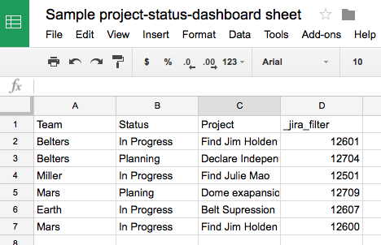
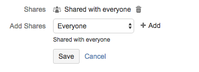
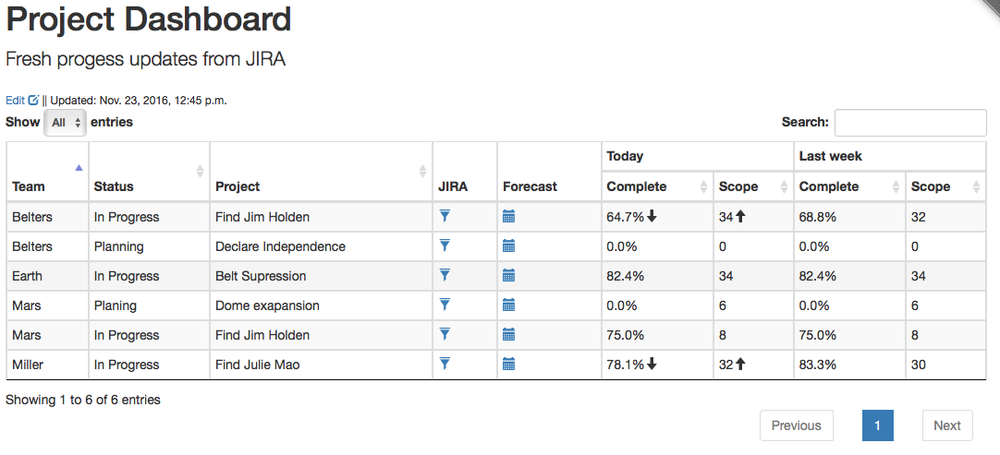
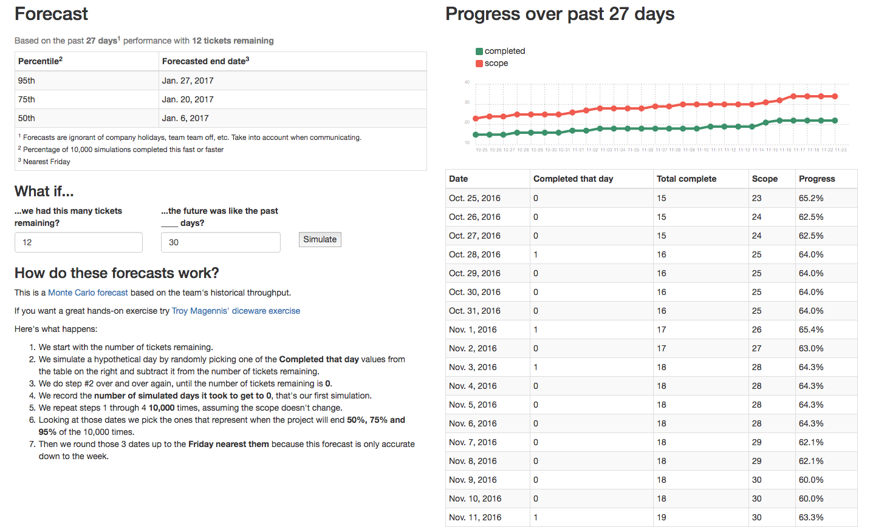
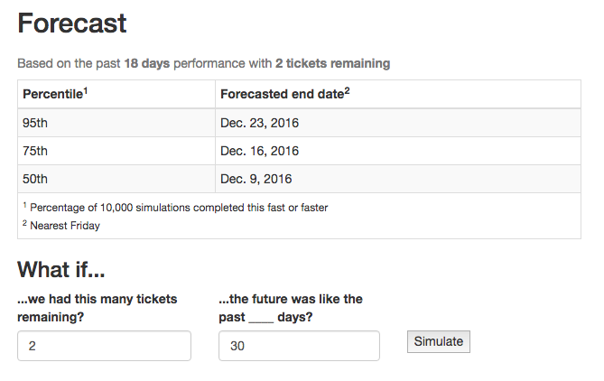

# project-status-dashboard

## Overview

project-status-dashboard is a way to surface information about multiple projects that are tracked in [JIRA](https://www.atlassian.com/software/jira) and to [expose predictions](http://focusedobjective.com/monte-carlo-forecasting-exercises/) about when they're completed.

You manage what projects are tracked and how they're displayed via [a Google spreadsheet](https://www.google.com/sheets/about/).

## How to use the dashboard

### Set up your Google spreadsheet


1. Create a google spreadsheet with *whatever columns* you want to display
1. Create a *special column* called **_jira_filter** this is how we'll tell the dashboard tickets are involved in the project
1. Put one project on each row, filling out as many columns as you like for that project
1. Publish the spreadsheet
    1. File > Publish to Web
    1. Entire Document
    1. [Example spreadsheet](https://docs.google.com/spreadsheets/d/e/2PACX-1vQ950QA97Rfzkya5I1WRmv12wlCPqF5qDeLtQtWKZzH_PZCR9FmApfzZ-83Zbu3bC9hHoi4Tr71UFWd/pubhtml)

### Create a JIRA filter for each project
1. Use whatever *JIRA search criteria* works for your team, common examples include:
    * By Epic: ```"Epic Link" = MYPROJ-101```
    * By tag: ```labels = theawesome-project```
    * By multiple Epics: ```"Epic Link" = MYPROJ-1342 OR "Epic Link" = MYPROJ-1472```
2. Save your JIRA filter
3. Share the JIRA filter with **Everyone**
4. Copy the **JIRA filter ID**: https://jira.example.com/issues/?filter=**12286**
5. Put the **filter ID** into the **_jira_filter** column for that project




### View the dashboard

The **_jira_filter** you provided will automatically add several columns to the ones you created

* **JIRA**: A link the filter, so you can dive into specific tickets
* **Forecast**: A link to the Forecast page for the project (see below)
* **Today**: The percentage of complete tickets, and the number of total tickets
    * The arrows indicate a change in completion and/or scope from the prior week
* **Last week**: The percentage of complete tickets, and the number of total tickets from one week ago

### View the forecast


The forecast view includes

* A chart displaying the change in scope and completion over time
* A tabular view of that same data
* A forecast of when the work would be completed **assuming the scope doesn't change** with various degress of confidence
* A form to modify the forecast

### Modify the forecast


You can experiment with the forecast to simulate some *"What if"* scenarios

* Modify the number of tickets remaining to see what effect cutting/growing scope might have on the forecasted end date
* Modify how many past days are sampled to generate the forecast if you think the default 30 day view is atypical -- maybe the past month had a lot of PTO, or maybe the team just shrunk because some folks were reassigned.
